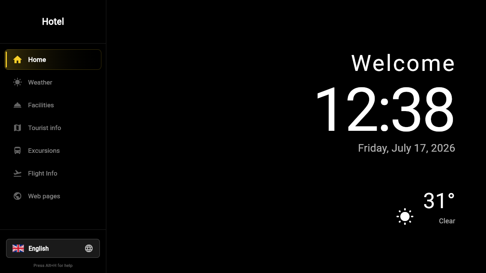
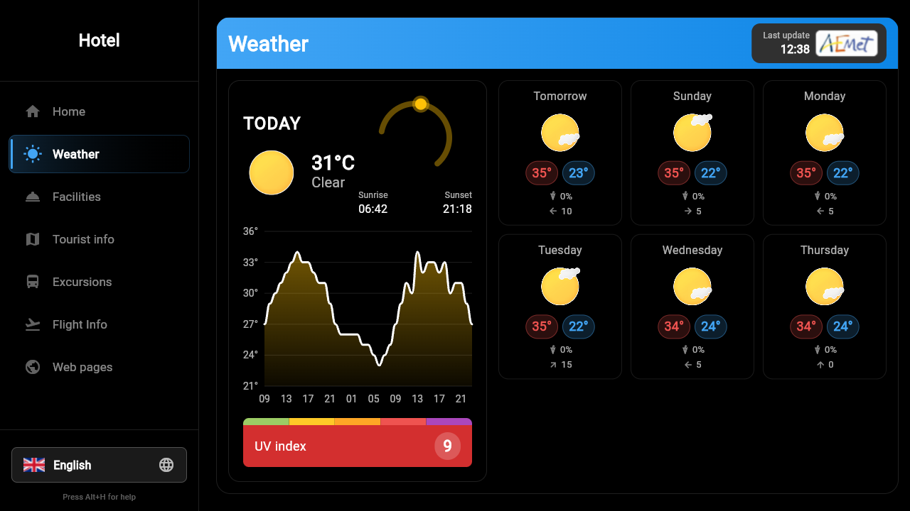
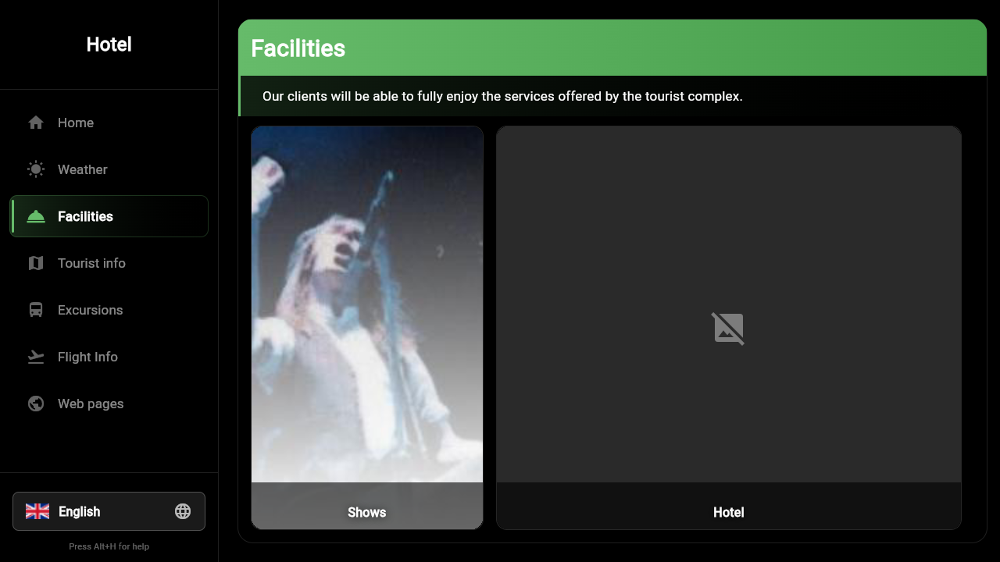
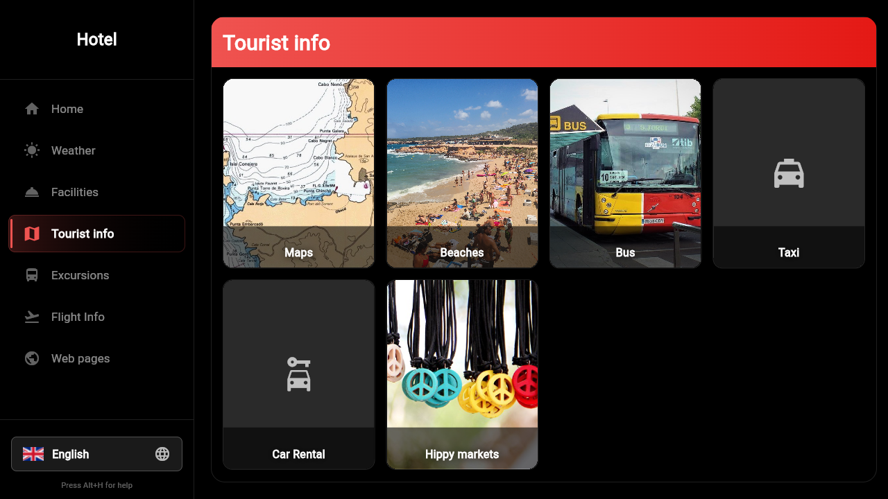
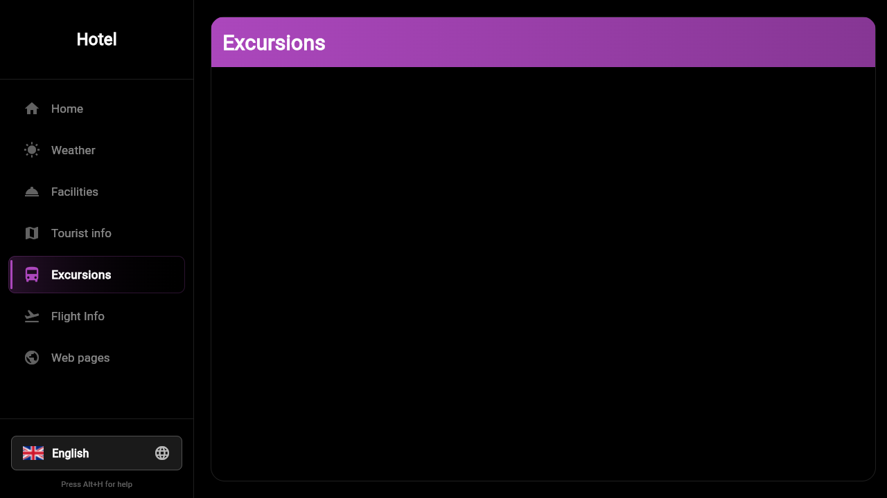
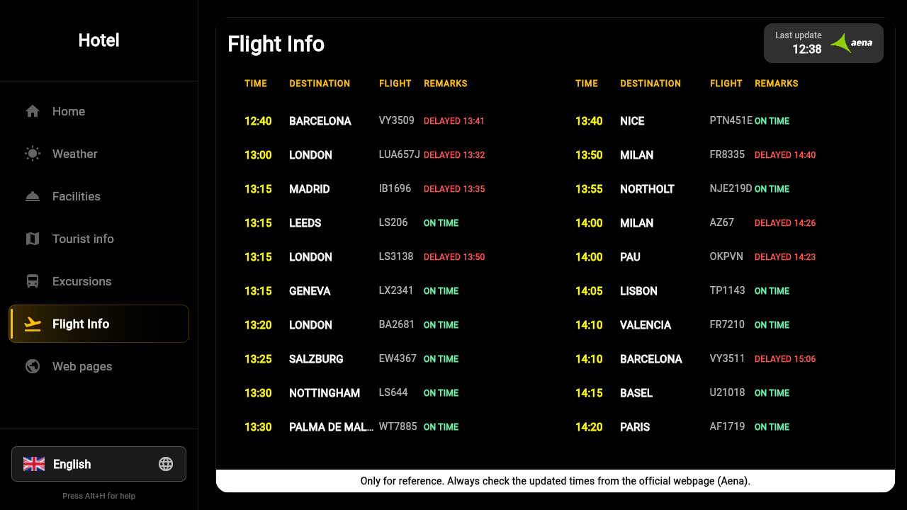
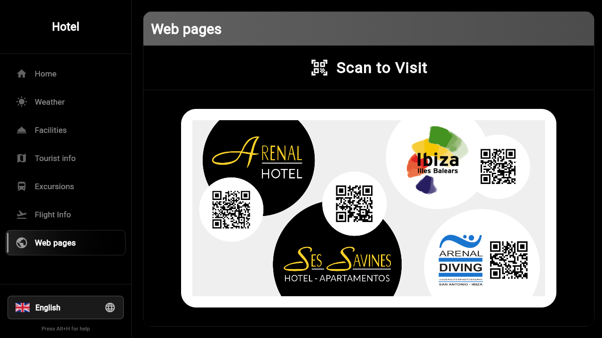

# InfoHotel Kiosk Application

A hotel information kiosk application built with Flutter, targeting Raspberry Pi 3B+.

## Features
- Immersive Kiosk Mode support
- Multi-language support (English, Spanish, Catalan, French, German, Italian, Dutch)
- Real-time weather integration via AEMET OpenData API
- Live flight information via backend scraper proxy
- Live bus departures via ALSA Ibiza GTFS (NAP API)
- Information directory for services, excursions, markets, beaches, shows, and webpages
- Interactive beaches panel with hotel distance info
- Data loaded from `hotel_assets` submodule with fallback to baked-in defaults

## Screenshots

| Welcome | Weather |
|:---:|:---:|
|  |  |

| Services | Tourist Info |
|:---:|:---:|
|  |  |

| Excursions | Flight Board |
|:---:|:---:|
|  |  |

| Webpages | — |
|:---:|:---:|
|  | |

## Requirements
- Flutter SDK `^3.10.1`
- AEMET OpenData API Key (weather)
- NAP API Key for ALSA Ibiza GTFS (buses)

## Getting Started

1. **Install Dependencies**
   Run the following command to download project dependencies:
   ```bash
   flutter pub get
   ```

2. **Configuration**
   The application requires API keys for real-time weather and bus information.
   Provide them at compile time using `--dart-define` flags.

   *Development Run:*
   ```bash
   flutter run --dart-define=AEMET_API_KEY=<key1> --dart-define=BUS_API_KEY=<key2>
   ```

   *Production Build (Web):*
   ```bash
   flutter build web --dart-define=AEMET_API_KEY=<key1> --dart-define=BUS_API_KEY=<key2>
   ```

   *Skip Private Data (screenshots/demos):*
   ```bash
   flutter run --dart-define=SKIP_HOTEL_ASSETS=true
   ```
   When set, the app falls back to baked-in defaults and does not load any `hotel_assets` data.

3. **Kiosk Interactions**
   - **F11**: Toggle Fullscreen Kiosk Mode.
   - **F2**: Toggle Content Edit Mode (allows managing excursions and market data).
   - **F1**: Toggle Help Overlay.
   - **Alt+T**: Cycle through hotel layouts.
   - **Ctrl+M** / **F3**: Toggle cursor visibility.

## Project Structure
- `lib/config`: Theming, environment variables, and constants.
- `lib/services`: State management, business logic, and API calls.
- `lib/views`: UI layout screens and modular widgets.
- `assets/`: Contains application images, PDF resources, and local default JSON data.
- `hotel_assets/`: Git submodule with per-hotel data (markets, excursions, shows, beaches).

## Deployment Notes
Data is loaded from the `hotel_assets` submodule directory (next to the executable or app documents) or falls back to baked-in defaults. Mutable content (excursions, markets, beaches) can be edited via F2 edit mode and saved to JSON. A deploy script is available at `scripts/deploy.sh` for building and deploying to a remote kiosk via SSH/Cloudflare Tunnel.
